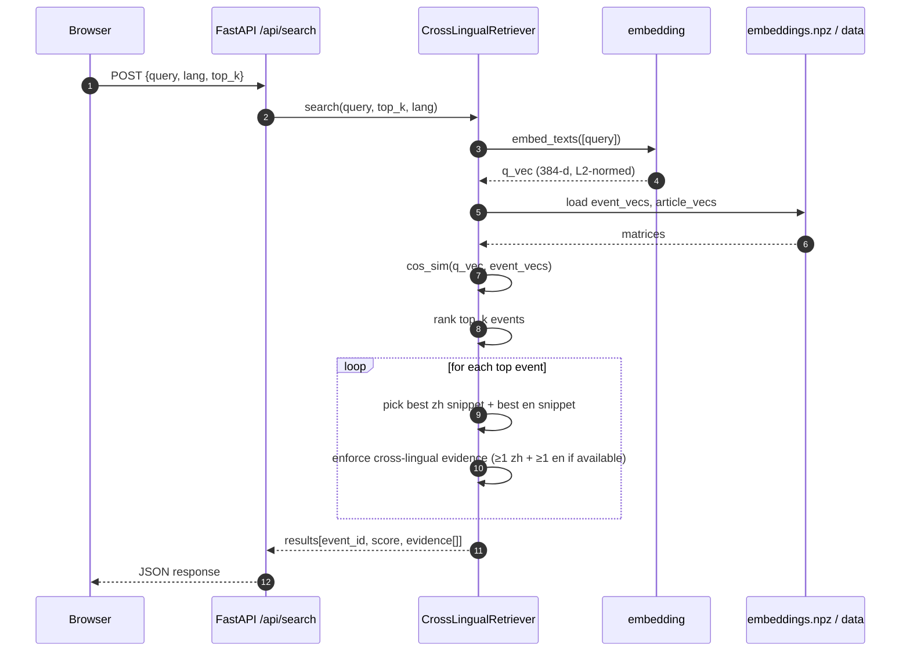

# 系统架构设计

本文档描述 Event Intelligence System 的分层架构、模块依赖、关键数据流与设计权衡。所有接口约束以仓库根目录的 `INTERFACE.md` 为准，本文档仅描述实现观察。

---

## 1. 分层架构

```
┌────────────────────────────────────────────────────────────────────┐
│ 表现层  Presentation Layer                                          │
│   - frontend/index.html      单页 dashboard                         │
│   - 5 个 view: Overview · Graph · Search · Briefing · Detail        │
│   - Tailwind / Alpine.js / ECharts                                  │
└────────────────────────────────────────────────────────────────────┘
                              │ JSON over HTTP
┌────────────────────────────────────────────────────────────────────┐
│ API 层  API Layer                                                   │
│   - backend/main.py          FastAPI 路由 + Pydantic schema         │
│   - 8 个端点（见 INTERFACE.md）                                       │
│   - 静态托管 frontend/，浏览器一键访问                                │
└────────────────────────────────────────────────────────────────────┘
                              │ Python 调用
┌────────────────────────────────────────────────────────────────────┐
│ 算法层  Algorithm Layer                                             │
│   - core/embedding.py        多语言向量化（含降级）                    │
│   - core/retrieval.py        跨语言融合检索                           │
│   - core/alignment.py        zh ↔ en 对齐与一致性                     │
│   - core/graph.py            事件演化图与 PageRank                    │
│   - core/briefing.py         证据约束的 LLM 生成                      │
└────────────────────────────────────────────────────────────────────┘
                              │ 文件 I/O
┌────────────────────────────────────────────────────────────────────┐
│ 数据层  Data Layer                                                  │
│   - data/events.json         topics + events + relations            │
│   - data/articles.json       中英新闻原文                            │
│   - embeddings.npz           首次运行自动构建的向量缓存                │
└────────────────────────────────────────────────────────────────────┘
```

层间约束：上层只依赖下层暴露的纯函数 / 类接口，不直接读取数据文件；算法层不感知 HTTP 协议；表现层不持有任何业务状态，全靠 API 拉取。

---

## 2. 模块依赖关系

```
                 ┌────────────┐
                 │  main.py   │   FastAPI 路由
                 └─────┬──────┘
        ┌──────┬───────┼────────┬──────────┐
        ▼      ▼       ▼        ▼          ▼
   embedding  retrieval graph  alignment briefing
        │      │        │        │          │
        │      ├────────┴────────┘          │
        │      │                            │
        └──────┴────────────┬───────────────┘
                            ▼
                  events.json / articles.json
                       embeddings.npz
```

- `embedding` 是叶子模块，纯函数式，被其他模块共享。
- `retrieval` 依赖 `embedding`；提供 `search` 与 `find_evidence` 两个对外能力。
- `graph` 仅依赖 `events.relations`，独立于嵌入。
- `alignment` 借 `embedding` 做跨语言相似度计算。
- `briefing` 是顶层编排器，组合 `retrieval + graph + alignment + LLM`。

---

## 3. 关键数据流

### 3.1 一次检索请求（sequence diagram）



### 3.2 一次简报生成

```
POST /api/briefing
  → BriefingGenerator.generate(topic_id?, event_ids?, language, style)
    1. 选定事件集（按 topic_id 或显式 event_ids）
    2. 通过 graph.compute_centrality 排序，取重要事件
    3. retrieval.find_evidence 为每个候选论点找证据 snippet
    4. 拼装 prompt：候选事件 metadata + snippet 列表 + style 模板
    5. 调 LLM API（Anthropic / OpenAI / DeepSeek 任一可用）
       - 失败 / 超时 → 模板生成（按 style 固定骨架）
    6. 校验：每个 section.citations 中的 snippet 必须能在 articles.json 子串匹配
       - 不通过的 citation 被丢弃；section 若失去全部 citations → 降级为模板段落
    7. alignment.consistency_score 评估同一事件 zh / en 摘要的一致性
       → 输出 cross_lingual_consistency
    8. 计算 risk_score = f(平均 intensity, 高 intensity 事件占比, 关系密度)
```

---

## 4. 关键设计决策与权衡

1. **JSON-only 数据层**。事件量在 30 量级、关系 27 条、文章 68 篇，远远不到需要数据库的体量。直接用 JSON 让评阅者打开仓库就能看到原始数据，diff 友好；代价是无法承载十万级事件，但课程作业不需要。

2. **嵌入模型 + 降级链**。生产路径用 `paraphrase-multilingual-MiniLM-L12-v2`（384 维，跨语言对齐质量较好且 CPU 友好）；离线降级到 TF-IDF + 哈希伪嵌入，避免无网络环境下整个系统崩盘。所有向量统一 L2 归一化、统一维度，让上层代码不感知降级。

3. **检索分数显式融合**。`Score = 0.6 · max(zh_sim, en_sim) + 0.4 · top1_article_sim` 这种线性组合容易调参、容易解释；权重不放在 config 里而是写死在代码里，避免课程作业过度配置化。跨语言证据强制不是后处理，是排序阶段的硬约束。

4. **LLM 后置校验**。LLM 输出 structured JSON 后，每个 citation 都要回到原文做子串匹配；不通过即丢弃。这一层校验等价于"凡是没有证据的话不许说"，避免 demo 时被老师抓到生成式幻觉。

5. **零构建前端**。Tailwind / Alpine / ECharts 全走 CDN，没有 npm 工程，没有 webpack。代价是首次加载依赖网络；好处是评阅者 clone 后零环境配置就能演示。

---

## 5. 启动与缓存

第一次运行 `scripts/run.bat` 时：

```
[1/3] pip install -q -r requirements.txt
[2/3] python scripts/build_embeddings.py
      → 加载 events + articles
      → 文本拼接（title + summary 用于事件，title + content 用于文章）
      → 调 embed_texts，写入 backend/data/embeddings.npz
[3/3] uvicorn main:app --reload --port 8000
```

第二次启动直接走缓存。`embeddings.npz` 在 `.gitignore` 中，避免污染仓库。
